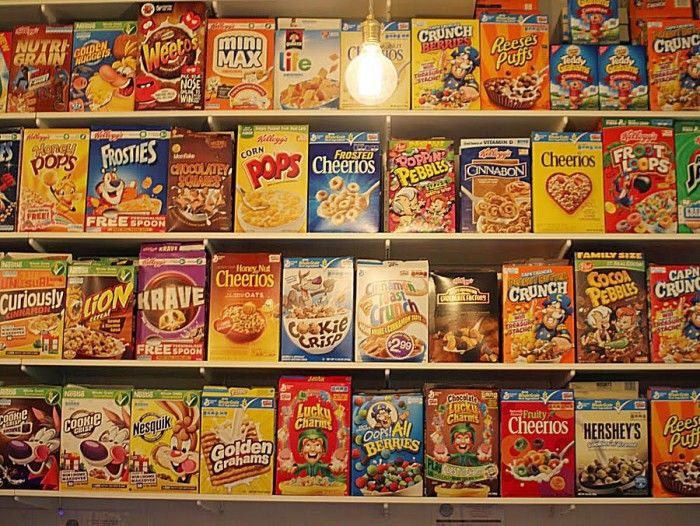

# PROJECT 2 - NUTRITION DATA ON 80 CEREAL BRANDS

## SEMESTER AND CLASS TITLE

Fall 2017, DATA 550 Data Visualization by Dr. Bora Pajo

## PURPOSE

To analyze the cereal nutrition data and to use at least two visualizations. 

Using pandas, seaborn, and matplotlib 
Created bar chart, pie chart, boxplot, strip plot, violin plot, and kdeplot 

## DATA SOURCE 

https://www.kaggle.com/crawford/80-cereals

This dataset has been converted to CSV

## AUTHOR'S NAME AND CONTACT

Oddinigwe Onyemenem - oddinigwe@gmail.com

## Context

This dataset contains 80 various brands of cereal and the nutritional facts of each of them from major cereal brand manufacturers. 

## Content

### Fields in the dataset:

The columns in the Cereal Nutrition dataset include: id, name, manufacturer, type, calories, protein, fat, sodium, fiber, carbos, sugar, potas, vitamins, shelf, weight, cups, rating, rating.1

Name: Name of cereal

Manufacturer: Manufacturer of cereal

General Mills

Kelloggs

Nabisco

Post Foods

Quaker Oats

Ralston Purina

type: cold or hot

calories: calories per serving

protein: grams of protein

fat: grams of fat

sodium: milligrams of sodium

fiber: grams of dietary fiber

carbo: grams of complex carbohydrates

sugars: grams of sugars

potass: milligrams of potassium

vitamins: vitamins and minerals - 0, 25, or 100, indicating the typical percentage of FDA recommended

shelf: display shelf (1, 2, or 3, counting from the floor)

weight: weight in ounces of one serving

cups: number of cups in one serving

rating: a rating of the cereals (Possibly from Consumer Reports?)

## INPUTS AND OUTPUTS...
