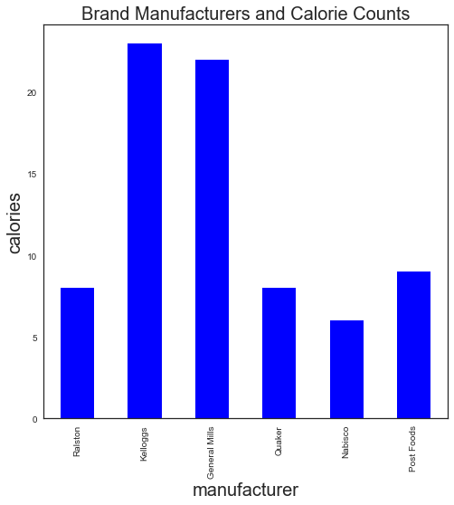
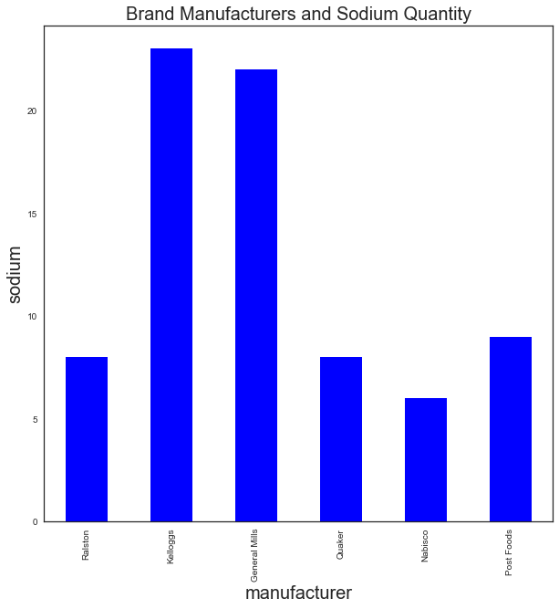
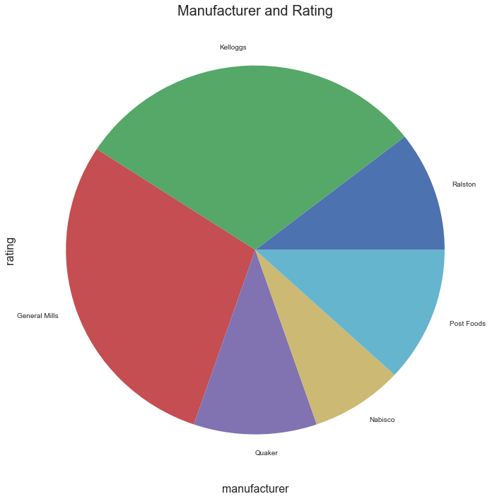
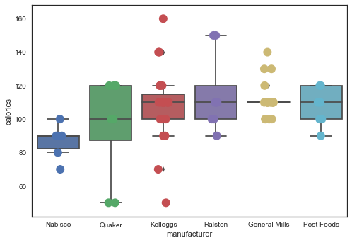
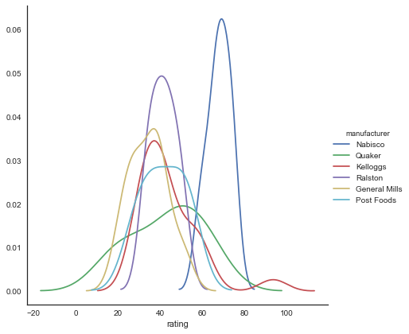
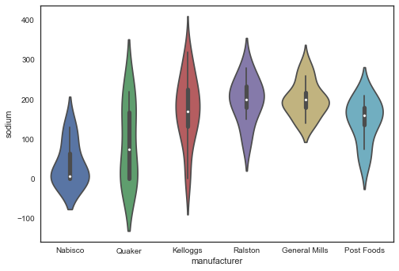

# PROJECT 2 - NUTRITION DATA ON 80 CEREAL BRANDS

## SEMESTER AND CLASS TITLE

Fall 2017, DATA 550 Data Visualization by Dr. Bora Pajo

## PURPOSE

To analyze the cereal nutrition data and to use at least two visualizations. 

Using pandas, seaborn, and matplotlib 
Created bar chart, pie chart, boxplot, strip plot, violin plot, and kdeplot 

## DATA SOURCE 

https://www.kaggle.com/crawford/80-cereals

This dataset has been converted to CSV

## AUTHOR'S NAME AND CONTACT

Oddinigwe Onyemenem - oddinigwe@gmail.com

## Context

This dataset contains 80 various brands of cereal and the nutritional facts of each of them from major cereal brand manufacturers. 


## Content

### Fields in the dataset:

The columns in the Cereal Nutrition dataset include: id, name, manufacturer, type, calories, protein, fat, sodium, fiber, carbos, sugar, potas, vitamins, shelf, weight, cups, rating, rating.1

Name: Name of cereal

Manufacturer: Manufacturer of cereal

General Mills

Kelloggs

Nabisco

Post Foods

Quaker Oats

Ralston Purina

type: cold or hot

calories: calories per serving

protein: grams of protein

fat: grams of fat

sodium: milligrams of sodium

fiber: grams of dietary fiber

carbo: grams of complex carbohydrates

sugars: grams of sugars

potass: milligrams of potassium

vitamins: vitamins and minerals - 0, 25, or 100, indicating the typical percentage of FDA recommended

shelf: display shelf (1, 2, or 3, counting from the floor)

weight: weight in ounces of one serving

cups: number of cups in one serving

rating: a rating of the cereals (Possibly from Consumer Reports?)

## INPUTS AND OUTPUTS

```
#to enable visualizations 
%matplotlib inline

# First, import pandas, a useful data analysis tool especially when working with labeled data
import pandas as pd

# import seaborn, visualization library in python 
import warnings # current version of seaborn generates a bunch of warnings that we'll ignore
warnings.filterwarnings("ignore")
import seaborn as sns
import matplotlib.pyplot as plt
sns.set(style="white", color_codes=True)

# Next, we'll load the cereal dataset, which is in the specified directory below
cereal = pd.read_csv("C:\\Users\\oddin\\Desktop\\cereal_project\\cereal.csv")

# Next, display the first 20 rows and all columns of the iris dataframe, good way to see the colum headings for the dataset
cereal.head(20)
```
```
# to count the frequency of values for each cereal brand manufacturer in the dataset
cereal["manufacturer"].value_counts()

Output:
Kelloggs         23
General Mills    22
Post Foods        9
Quaker            8
Ralston           8
Nabisco           6
Name: manufacturer, dtype: int64
```
```
#To create a bar chart showing the various cereal brands on the x-axis and calories on the y-axis
fig,ax = plt.subplots(figsize=(10,10))
cereal['manufacturer'].value_counts(sort=False).plot(kind='bar',color = 'blue')
plt.title('Brand Manufacturers and Calorie Counts',fontsize=20)
plt.xlabel('manufacturer',fontsize=20)
plt.ylabel('calories',fontsize=20)
```


```
#To create a bar chart showing the various cereal brands on the x-axis and sodium on the y-axis
fig,ax = plt.subplots(figsize=(10,10))
cereal['manufacturer'].value_counts(sort=False).plot(kind='bar',color = 'blue')
plt.title('Brand Manufacturers and Sodium Quantity',fontsize=20)
plt.xlabel('manufacturer',fontsize=20)
plt.ylabel('sodium',fontsize=20)
```


```
#To create a pie chart showing cereal manufacturers and ratings
fig,ax = plt.subplots(figsize=(12,12))
cereal['manufacturer'].value_counts(sort=False).plot(kind='pie')
plt.title('Manufacturer and Rating',fontsize=20)
plt.xlabel('manufacturer',fontsize=16)
plt.ylabel('rating',fontsize=16)
```


```
# A good way to complement the boxplot is by using the Seaborn's striplot
# Use jitter=True so that all the points are not represented(clustered) on the same axis,
#this allows the data to be properly represented
# Saving the resulting axes as ax each time causes the resulting plot to be shown
# on top of the previous axes
# added size to make the change the size of the dots i.e. bigger or smaller
# changed edge color
ax = sns.boxplot(x="manufacturer", y="calories", data=cereal)
ax = sns.stripplot(x="manufacturer", y="calories", data=cereal, jitter=True, size = 12, edgecolor="black")
```


```
# To create a kdeplot which is a seaborn plot useful for looking at univariate relations 
# Creates and visualizes a kernel density estimate of the underlying feature

sns.FacetGrid(cereal, hue="manufacturer", size=6) \
   .map(sns.kdeplot, "rating")\
   .add_legend()
```
   

```
# A violin plot combines the benefits of the previous two plots and simplifies them
# Violin plot, unlike box plots, depict the density of the data
# Denser regions of the data are fatter, and sparser thiner in a violin plot
# further showing the distributions of the features i.e. petallength
sns.violinplot(x="manufacturer", y="sodium", data=cereal, size=10)
```


```
